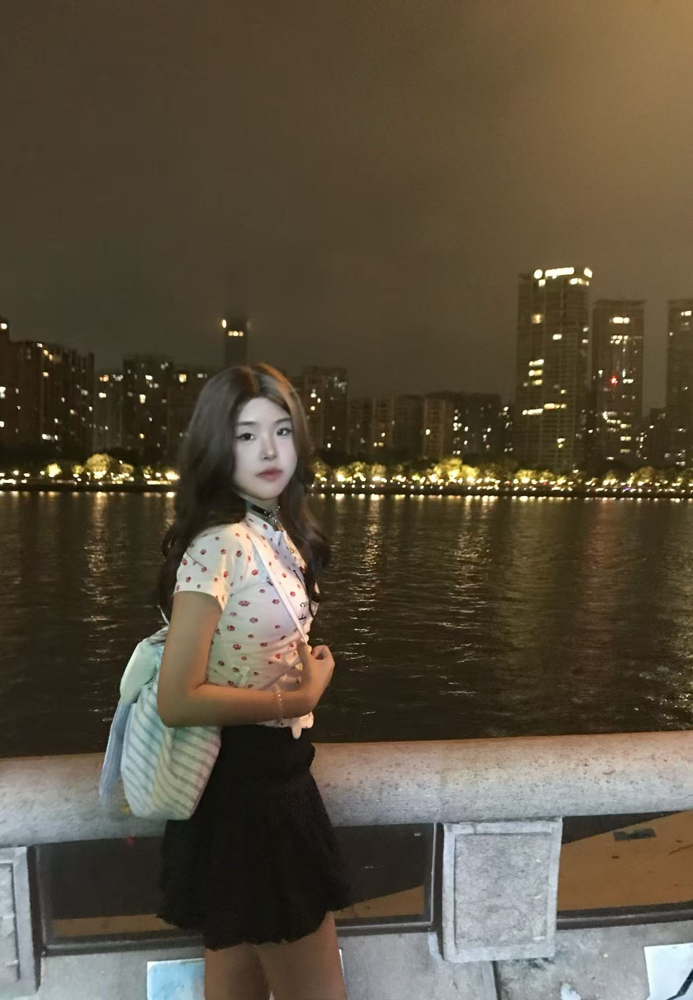
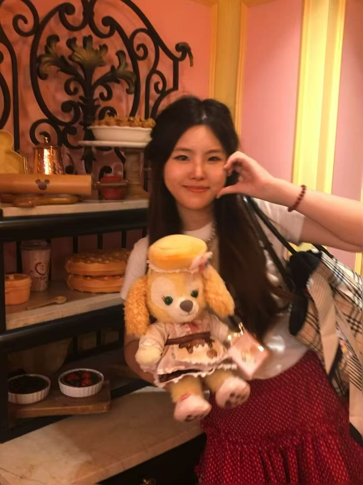
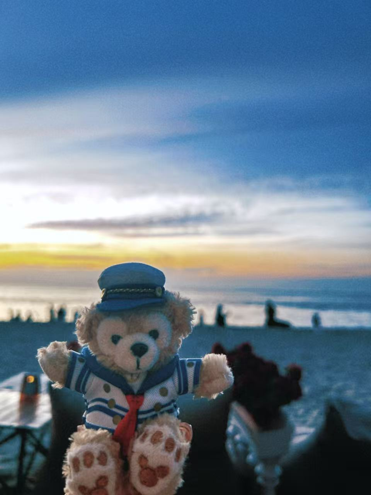
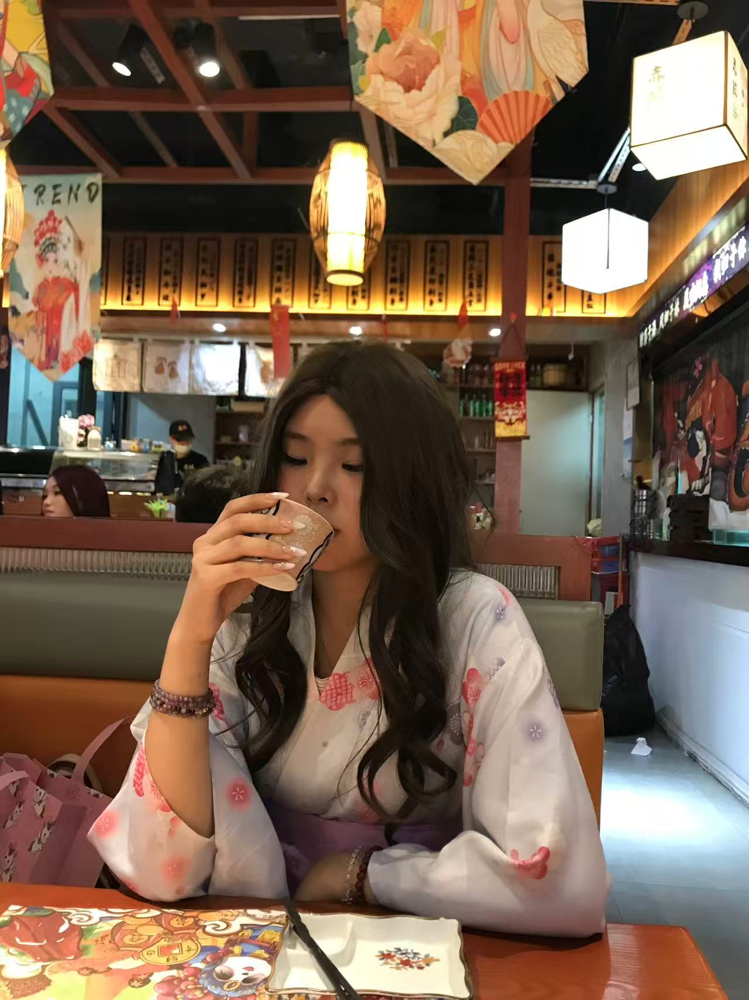

<!DOCTYPE html>
<html lang="en">
<head>
    <meta charset="UTF-8">
    <meta name="viewport" content="width=device-width, initial-scale=1.0">
    <title>Jiaying Xiong ♡ New Media</title>
    <link rel="stylesheet" href="style.css">
</head>
<body>
<header class="navbar">
    

        <h2 class="logo">Jiaying’s Pink Portfolio ૮₍♡˃ ᵕ ˂♡₎ა</h2>
        <ul class="nav-list">
            <li><a href="#home">Home 🏠</a></li>
            <li><a href="#about">About Me 🐶</a></li>
            <li><a href="#education">Education 🎓</a></li>
            <li><a href="#hobby">Hobbies ⛹️</a></li>
            <li><a href="#achieve">Interests ✨</a></li>
            <li><a href="#gallery">Gallery 📸</a></li>
            <li><a href="#contact">Contact 💌</a></li>
        </ul>
    

</header>

<section id="home" class="home">
    

        

            
            

                <h1>Hi! I'm Xiong Jiaying (๑>◡<๑)</h1>
                
New Media | University: In Malaysia

                
ENFP | Coffee & Puppy & Dessert Lover 💖

            

        

    

</section>

<section id="about" class="section">
    

        <h2 class="title">About Me ૮₍˶•༝•˶₎ა</h2>
        

            
I am an outgoing ENFP student majoring in New Media.
            I love coffee, cute little dogs and all sweet desserts 🍰.
            I enjoy staying close to nature and making new warm friends 💓.

        

    

</section>

<section id="education" class="section bg-pink">
    

        <h2 class="title">Education 📚</h2>
        

            <h3>University: In Malaysia ˚ʚ♡ɞ˚</h3>
            
Programme: New Media

            
Current Undergraduate Student

        

    

</section>

<section id="hobby" class="section">
    

        <h2 class="title">My Hobbies ૮₍´˶• . • ⑅₎ა</h2>
        <ul class="hobby-list">
            <li>🏊 Swimming</li>
            <li>🎾 Play Tennis</li>
            <li>📖 Learn new languages</li>
        </ul>
    

</section>

<section id="achieve" class="section bg-pink">
    

        <h2 class="title">Life & Interests ✧⁺⸜♡⸝⁺✧</h2>
        

            
I love travelling, meeting friends and trying all new interesting things.
            I love reading history books and watching movies 🎬, I watch one movie every Monday!
            Always look forward to every upcoming wonderful surprise ૮₍ ˃ ⤙ ˂ ₎ა

        

    

</section>

<section id="gallery" class="section">
    

        <h2 class="title">Photo Gallery 📷</h2>
        

            

            

            

            

        

    

</section>

<section id="contact" class="section bg-pink">
    

        <h2 class="title">Contact 💌</h2>
        

            
Name: Xiong Jiaying

            
Course: New Media

            
Email: yintiantoo@gmail.com

        

    

</section>

<footer class="footer">
    
©2026 Jiaying | SMM30503 IA1 Assignment ♡ All Pink Cute Design

</footer>
</body>
</html>
